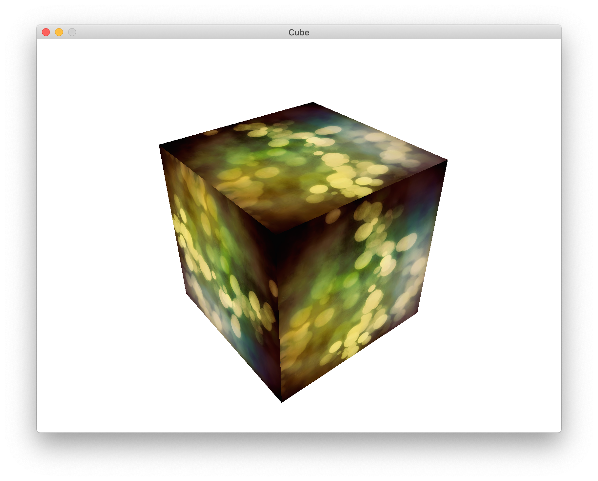

# Drawable 

This project aim to build easy to use opengl drawable object. 
This is meant to be as less invasive as possible.

This is build with 2D in mind but should not be limited to it.

see `example to see more`

# Example 

This example is a simpler version of [the opengl cube](https://github.com/go-gl/example/blob/master/gl41core-cube/cube.go)

```go
package main

import (
	"fmt"
	"github.com/canadadry/drawable/geometry"
	"github.com/canadadry/drawable/program"
	"github.com/canadadry/drawable/program/shader"
	"github.com/canadadry/drawable/texture"
	"github.com/go-gl/gl/v4.1-core/gl"
	"github.com/go-gl/glfw/v3.2/glfw"
	"github.com/go-gl/mathgl/mgl32"
	"log"
	"runtime"
)

const windowWidth = 800
const windowHeight = 600

var (
	projection = mgl32.Perspective(mgl32.DegToRad(45.0), float32(windowWidth)/windowHeight, 0.1, 10.0)
	camera     = mgl32.LookAtV(mgl32.Vec3{3, 3, 3}, mgl32.Vec3{0, 0, 0}, mgl32.Vec3{0, 1, 0})
	model      = mgl32.Ident4()
)

func init() {
	runtime.LockOSThread()
}

func main() {
	if err := glfw.Init(); err != nil {
		log.Fatalln("failed to initialize glfw:", err)
	}
	defer glfw.Terminate()

	glfw.WindowHint(glfw.Resizable, glfw.False)
	glfw.WindowHint(glfw.ContextVersionMajor, 4)
	glfw.WindowHint(glfw.ContextVersionMinor, 1)
	glfw.WindowHint(glfw.OpenGLProfile, glfw.OpenGLCoreProfile)
	glfw.WindowHint(glfw.OpenGLForwardCompatible, glfw.True)
	window, err := glfw.CreateWindow(windowWidth, windowHeight, "Cube", nil, nil)
	if err != nil {
		panic(err)
	}
	window.MakeContextCurrent()

	if err := gl.Init(); err != nil {
		panic(err)
	}

	version := gl.GoStr(gl.GetString(gl.VERSION))
	fmt.Println("OpenGL version", version)

	p, err := program.New(shader.Basic)
	if err != nil {
		panic(err)
	}
	p.Use()

	err = p.Uniform(shader.Basic.Uniform[0], projection)
	if err != nil {
		panic(err)
	}
	err = p.Uniform(shader.Basic.Uniform[1], camera)
	if err != nil {
		panic(err)
	}
	err = p.Uniform(shader.Basic.Uniform[2], model)
	if err != nil {
		panic(err)
	}

	t, err := texture.FromImage("square.png")
	if err != nil {
		log.Fatalln(err)
	}

	part := []program.VBOPart{
		{shader.Basic.Attribute[0], 3},
		{shader.Basic.Attribute[1], 2},
	}

	g := geometry.NewCube(mgl32.Vec3{}, 1.0)

	b := program.NewBuffer(p, part, g.Buf)

	gl.Enable(gl.DEPTH_TEST)
	gl.DepthFunc(gl.LESS)
	gl.ClearColor(1.0, 1.0, 1.0, 1.0)

	for !window.ShouldClose() {
		gl.Clear(gl.COLOR_BUFFER_BIT | gl.DEPTH_BUFFER_BIT)

		model = mgl32.HomogRotate3D(float32(glfw.GetTime()), mgl32.Vec3{0, 1, 0})

		p.Use()
		p.Uniform(shader.Basic.Uniform[2], model)
		b.Bind()
		t.Bind()
		g.Draw()

		window.SwapBuffers()
		glfw.PollEvents()
	}
}
```

Instead of using a hard to read and maintain OpenGL interface you can more strait forward Drawable API. 



## Futur

I want to build a more complet set of tool on top of those 3 modules (`geometry`,`program`,`texture`) 
My inspiration will came for what SFML has done in its Graphics Module.

